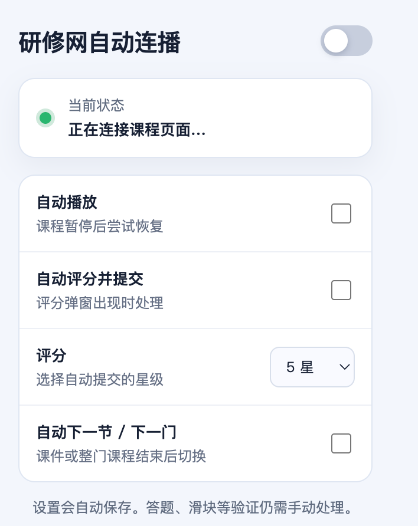

# 研修网自动连播

适用于 `ipx.yanxiu.com` 课程页面的 Chrome Manifest V3 扩展。非研修网官方项目。

请仅在自己的账号中、遵守课程及平台要求使用。本扩展不跳过视频进度，也不处理答题、滑块、考试或问卷。

## 功能

- 视频暂停且没有其他验证弹窗时，尝试恢复播放；若 Chrome 拦截有声自动播放，则改为静音续播。
- 出现“您的评分是给老师的鼓励”时，自动选择设定星级并点击“提交”。
- 出现“恭喜您，已完成本节内容！”时，优先点击本课程内的“观看下一节课程”。
- 到达本课程最后一节时，按当前项目学段、学科和课程组读取课程列表的分页数据，查找当前课程后第一门尚未看完且允许观看的课程，并打开该课程。若当前课程组已经结束，再尝试项目内后续课程组。
- 扩展弹窗中可以分别开关自动播放、自动评分和自动下一节/下一门，并设置 1～5 星。
- 不会自动处理答题、滑块、考试或问卷。

## 安装

从仓库下载代码并解压；如果下载的是 Release 安装包，也请先解压。不要直接选择 ZIP 文件。

1. 在 Chrome 地址栏打开 `chrome://extensions/`。
2. 打开右上角“开发者模式”。
3. 点击“加载已解压的扩展程序”。
4. 选择整个 `yanxiu-autoplay-extension` 文件夹。
5. 回到课程页面并刷新一次。

如果已加载过这个文件夹，在 `chrome://extensions/` 找到“研修网自动连播”并点击刷新图标，然后刷新课程页面。覆盖文件但不刷新扩展时，Chrome 仍会运行旧脚本。

安装后默认开启全部三项功能，评分默认为 5 星。点击浏览器工具栏中的扩展图标可修改设置。

## 使用提示

- Chrome 可能阻止带声音的自动播放。遇到这种情况时，扩展会尝试静音续播，并在状态中提示。若需要听到声音，请在页面上手动开启；扩展不会绕过浏览器的有声自动播放限制。
- 如果站点页面已经打开，再安装扩展后必须刷新该课程页面，内容脚本才会生效。
- 站点若更新页面结构，可先在扩展弹窗中关闭总开关，避免误操作。
- 跨课程查找使用网站自己的课程列表接口并处理分页，不修改页面或跳过播放。接口若未返回下一门课程所需的课程 ID、课程来源 ID、课程组 ID，扩展不会猜测地址。
- 若没有找到可自动打开的下一门课程，会回到当前项目的选课页。
- 扩展只向研修网自己的 `ipx-api.yanxiu.com` 读取当前账号可见的课程列表；登录信息仅用于该站点请求。

## 已针对的生产页面结构

- 评分弹窗：`.scoring-wrapper`
- 星级控件：`.info-rate .rate-item`（兼容旧版 `.ivu-rate-star`）
- 结束遮罩：`.ended-mask`
- 下一节入口：`.ended-mask .next`

这些选择器来自 2026-09-23 站点生产前端资源，同时代码包含少量结构兜底。

## 开源许可

本项目使用 [MIT License](LICENSE)。
